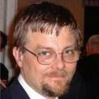
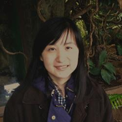

.. _chap-index:

The ``esig`` Python Package
===========================

This is the online documentation for the Python ``esig`` package. Below you'll find the table of contents.

.. toctree::
   :maxdepth: 3
   
   about
   prerequisites
   installing
   troubleshooting

``esig``: What is it?
---------------------
The ``esig`` package provides implementations of a series of mathematical tools for the handling of the *signature* of a *path*. Powered by the underlying ``libalgebra`` C++ package, developed by Terry Lyons et al. over a period of 15 years, the ``esig`` package has been further developed and extended by three 2017 Summer interns at the `Alan Turing Institute <http://www.turing.ac.uk/>`_, London, England. Below we provide an explanation of what a path and a signature are -- it gets mathematical.

Consider a *path* as smooth mapping from a time interval into some multidimensional space; it is a special case of a continuous stream of data. A *signature* is a canonical transform of a data stream into a high dimensional space of features; ``esig`` is a package for implementing this transform for paths -- as a mathematical object, a signature is an infinite tensor series. ``esig`` works with the truncated signatures having a certain *degree*.  Formally and for piecewize linear or smooth paths, each coordinate of the signature tensor is an iterated Riemann-Stieltjes integral; the ensemble of these values represents an element in the tensor algebra of Euclidean space. Precise definitions and an introduction to this particular research area can be found in `this article <https://arxiv.org/abs/1405.4537>`_ written by Terry Lyons, as well as `this survey paper <https://arxiv.org/abs/1602.03255>`_.

In practice, paths are easy to visualize and summarise in the case where they are (well approximated) by piecewise linear functions. If the initial and end points, as well as the intermediate points where direction changes, are collected into an array then this discrete stream contains a full description of the path. The ``esig`` package takes such an array as argument, and computes the signature (or logsignature) of the associated path truncated at a chosen degree.

The ``esig`` package is a python package, and the function stream2sig requires an input array that is an np.array((l,n),dtype=float) of shape ``(l,n)`` where: ``l`` is the number of sample points in the path including both ends and ``n`` is the dimension of the target space where the points live. In the following example, the path is given as the list of coordinate vectors of points defining the piecewise linear path.

.. code::
	
	(0,1) --> (1,1) --> (2,2) --> (3,0)

The signature is then computed by calling a degree, after formatting the data as a float based ``numpy.array``. The degree is roughly defined as the number of iterations in the integration performed. In this example, degree 3 means that all of the possible combinations of the coordinate functions

.. code::
	
	x_1 = (0 --> 1 --> 2 --> 3)
	x_2 = (1 --> 1 --> 2 --> 0)

of length 3 or lower are integrated over. There is 1 combination of length 0, 2 combinations of lenght 1, 4 combinations of length 2, 8 combinations of length 3, making the resulting vector have dimension 15.

The signature is a vectorisation of the path where the dimension of the feature set does not depend on the number of points along the path.

If you're interested in how the software was packaged up, you can look at the small reflection paper written by one of the Summer interns, David Maxwell. The paper is available on `arXiv <https://arxiv.org/>`_.

``esig``: How to use it?
---------------------
Once installed the ``esig`` package provides a very simple implementations for a limited series of core mathematical operations for the handling of the *signature* of a *path.* 

To get started import tosig from esig:

.. code::
	
>>> from esig import tosig as ts

Then get help on the functionality tosig provides

.. code::

>>> help(ts)

NAME
    esig.tosig - This is the tosig module from ESIG

FUNCTIONS
    logsigdim(...)
        logsigdim(signal_dimension, signature_degree) returns a Py_ssize_t integer giving the dimension of the log signature vector returned by stream2logsig

    logsigkeys(...)
        logsigkeys(signal_dimension, signature_degree) returns, in the order used by ...2logsig, a space separated ascii string containing the keys associated the entries in the log signature returned by ...2logsig

    sigdim(...)
        sigdim(signal_dimension, signature_degree) returns a Py_ssize_t integer giving the length of the signature vector returned by stream2logsig

    sigkeys(...)
        sigkeys(signal_dimension, signature_degree) returns, in the order used by ...2sig, a space separated ascii string containing the keys associated the entries in the signature returned by ...2sig

    stream2logsig(...)
        stream2logsig(array(no_of_ticks x signal_dimension), signature_degree) reads a 2 dimensional numpy array of floats, "the data in stream space" and returns a numpy vector containing the logsignature of the vector series up to given signature_degree

    stream2sig(...)
        stream2logsig(array(no_of_ticks x signal_dimension), signature_degree) reads a 2 dimensional numpy array of floats, "the data in stream space" and returns a numpy vector containing the signature of the vector series up to given signature_degree

To understand better, lets look at some of the helper functions

.. code::
	
>>> ts.sigkeys(2,4)
' () (1) (2) (1,1) (1,2) (2,1) (2,2) (1,1,1) (1,1,2) (1,2,1) (1,2,2) (2,1,1) (2,1,2) (2,2,1) (2,2,2) (1,1,1,1) (1,1,1,2) (1,1,2,1) (1,1,2,2) (1,2,1,1) (1,2,1,2) (1,2,2,1) (1,2,2,2) (2,1,1,1) (2,1,1,2) (2,1,2,1) (2,1,2,2) (2,2,1,1) (2,2,1,2) (2,2,2,1) (2,2,2,2)'

enumerates a basis for the tensor algebra on an alphabet of size 2 up to degree 4 as a text string. ts.sigkeys(2,4).strip().split(" ") provides the same basis as a list. The signature is then computed by calling stream2sig(path_data, truncation_degree), after formatting path_data as a ``numpy.array``. The degree d is roughly defined as the maximal order to which iterated integration is performed. The signature can then be represented as a linear combination of words of length at most d. The logsignature has a more complicated but more compact representation.

``esig`` has other helper functions that can be used to access the data effectively.

.. code::

	>>> ts.sigkeys(2,4).strip().split(" ")[ts.sigdim(2,2):ts.sigdim(2,3)]
    ['(1,1,1)', '(1,1,2)', '(1,2,1)', '(1,2,2)', '(2,1,1)', '(2,1,2)', '(2,2,1)', '(2,2,2)']

trims the full basis to only those elements that have degree three in the tensor basis. 

Very similar code works for calculating, accessing and manipulating the basis for the lie elements used for log signatures and the log signature itself:

.. code::

    >>> ts.logsigkeys(2,4).strip().split(" ")[ts.logsigdim(2,2):ts.logsigdim(2,3)]
    ['[1,[1,2]]', '[2,[1,2]]']

Computing signatures and log signatures from the discrete sequences is achieved using stream2sig and stream2logsig. 

Following the discussion above: The input stream is a numpy array of floats (not integers!); if one varies the first index and fixes the second index then the values are those along a coordinate path (not increments), the number of coordinate paths or channels in the path is determined by the second index, stream2sig deduces this from the width of the numpy array. The depth of the calculated signature is an argument to be chosen by the user. The ouput is a one dimensional array of numbers and is to be interpreted as the coefficients of the basis elements produced by sigkeys delivered in the same order. 

The program as written will only do calculations that fit easily into 32 bit memory and will reject widths and depths that produce larger problems with an error message at the command line. This is to discourage exponentially large problems that hang your computer. The underlying C++ code is structured as a sparse tensor. It can handle much larger problems. The source code is available in the libalgebra folder in the PyPi source code file (the gz file).

The stream2... code is thread safe and parallelizing it can dramatically accelerate computations where many signatures need to be computed. All signature code works through massive memoisation so this thread safety should never be assumed without testing. 

Who is Involved?
----------------
Over the Summer of 2017, a team of interns worked on developing the ``esig`` package to a point where it was ready to be shown to the world. The interns were working at the `Alan Turing Institute <http://www.turing.ac.uk/>`_, London, England. They were supervised by Professor Terry Lyons of the Mathematical Institute, Oxford, and Dr Hao Ni of UCL.

We should note that the the underlying C++ libraries that allow ``esig`` to exist have been developed by Professor Lyons and his colleagues and students over a number of years leading up to this internship. Without their hard work, this project would not exist as it is today. In a future revision of this documentation, we'll update this portion with the names of those who were involved.

For now though, here are the five people who have worked on developing ``esig`` in recent times.

+---------+--------------------------------------------------------------------------------+
| |terry| | | **Professor Terry Lyons**                                                    |
|         | | Mathematical Institute, Oxford                                                         |
|         | | terry.lyons@maths.ox.ac.uk                                                   |
+---------+--------------------------------------------------------------------------------+
| |hao|   | | **Dr Hao Ni**                                                                |
|         | | Senior Lecturer, UCL                                                         |
|         | | h.ni@ucl.ac.uk                                                               |
+---------+--------------------------------------------------------------------------------+
| |alex|  | | **Alexandru Cioba**                                                          |
|         | | PhD Student, UCL                                                             |
|         | | a.cioba.12@ucl.ac.uk                                                         |
+---------+--------------------------------------------------------------------------------+
| |radek| | | **Radoslaw Kowalski**                                                        |
|         | | PhD Student, UCL                                                             |
|         | | radoslaw.kowalski.14@ucl.ac.uk                                               |
+---------+--------------------------------------------------------------------------------+
| |david| | | **David Maxwell**                                                            |
|         | | PhD Student, University of Glasgow                                           |
|         | | d.maxwell.1@research.gla.ac.uk                                               |
+---------+--------------------------------------------------------------------------------+